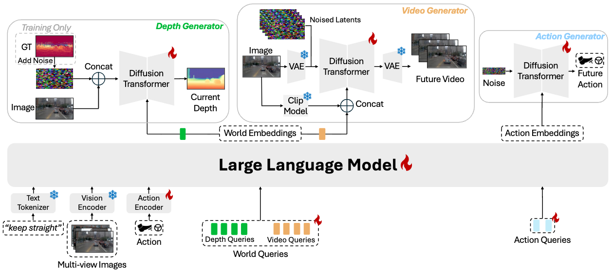

# DriveDreamer-Policy
DriveDreamer-Policy: A Geometry-Grounded World–Action Model for Unified Generation and Planning

## Updates 

- [04/2026] We release the paper draft on [arXiv](https://arxiv.org/abs/2604.01765) and code is coming soon!

## License 

All code within this repository is under [Apache License 2.0](https://www.apache.org/licenses/LICENSE-2.0).